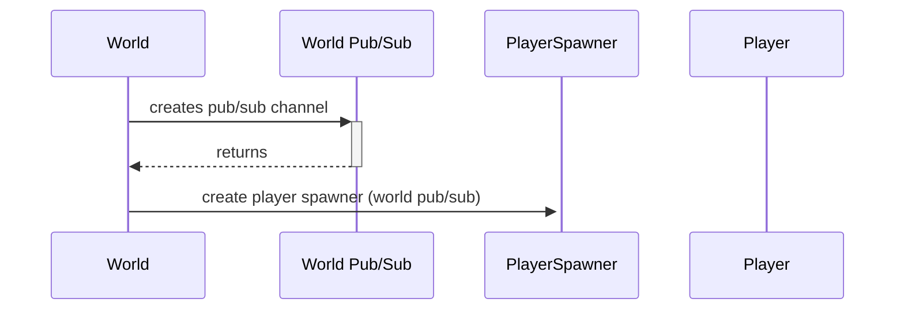

# Diagram

```mermaid
sequenceDiagram

participant w as World
participant wps as World Pub/Sub
participant ps as PlayerSpawner
participant p as Player

w ->>+ wps: creates pub/sub channel
wps -->>- w: returns

w ->>+ ps: create player spawner (world pub/sub)
```
