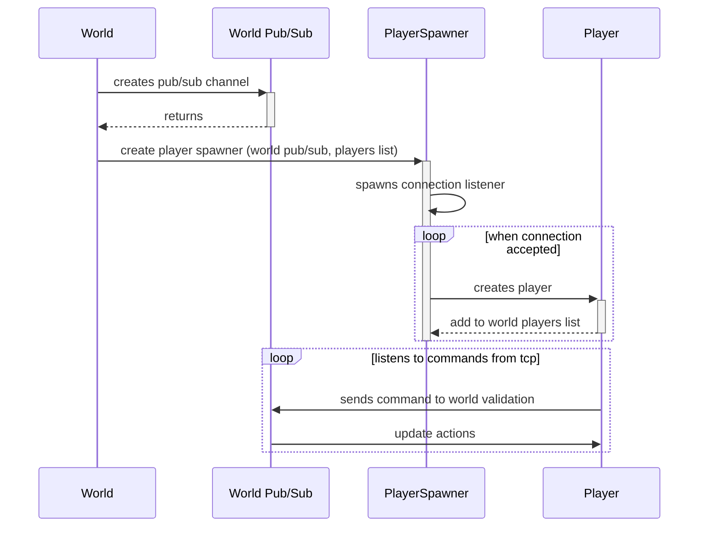

# Diagram

```mermaid
sequenceDiagram

participant w as World
participant wps as World Pub/Sub
participant ps as PlayerSpawner
participant p as Player

w ->>+ wps: creates pub/sub channel
wps -->>- w: returns

w ->>+ ps: create player spawner (world pub/sub, players list)
ps ->> ps: spawns connection listener
loop when connection accepted

ps ->>+ p: creates player
p -->>- ps: add to world players list
end
deactivate ps

loop listens to commands from tcp
p ->> wps: sends command to world validation
wps ->> p: update actions
end
```
